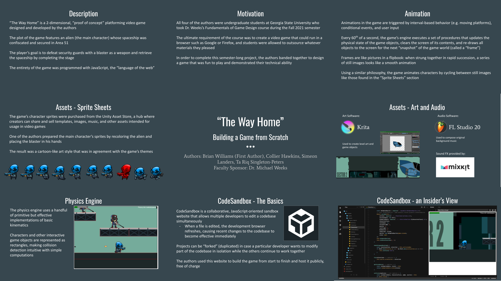

# The Way Home
_The Way Home_ is a browser-based, 2d-platforming video game created during the Fall 2021 semester at Georgia State University for Dr. Michael Weeks's Fundamentals of Game Design (CSC 4821) course.  
This project was a collaborative effort between four undergraduate [students](#authors--contributions) and was submitted for the course's final assignment along with a [video](https://youtu.be/Dy2eZXNsMgg) that was presented to the class on the final day of the course.

### Play the game [here](https://g9fr8w.csb.app/)!

### Synopsis
_The Way Home_'s plot features an unnamed alien who must traverse a sector of Area 51 in order to retrieve his confiscated airship and return to his home planet. The player assumes control of the alien to jump onto platforms, fight against military guards, and escape the facility unharmed.

The game's engine was designed and implemented entirely from scratch via vanilla JavaScript and HTML5, intended to be a demonstration of the convenience and versatility of JavaScript as an all-purpose, high-level programming language, as well as fulfill the project requirement of running in a browser without downloads.

A poster was presented at the Georgia State Undergraduate Research Conference in the following Spring semester:

### Authors & Contributions
Collier Hawkins
- Music
- Acquisition of sound effects
- Miscellaneous art and sprite editing

Simeon Landers
- Acquisition of sprite art
- Game level design

Ta Riq Singleton-Peters
- Game level design

Brian Williams (lead programmer)
- Physics engine
- User interface engine
- Keyboard input handling
- File and asset organization
- Implementation of all core gameplay mechanics

### Software Tools & Other Resources
- [CodeSandbox](https://codesandbox.io/) (hosting; live reloading; real-time collaborative programming)
- [FL Studio](https://www.image-line.com/fl-studio/) (music)
- [Krita](https://krita.org/en/) (miscellaneous art)
- [Mixkit](https://mixkit.co/) (sound effects)
- [Unity Asset Store](https://assetstore.unity.com/) (sprite art)
  - Package used: Zuhria A's "[Future Soldiers - Game Sprites](https://assetstore.unity.com/packages/2d/characters/future-soldiers-game-sprites-83741)"

### Notes
- This repository is copied from the original CodeSandbox source that was used to develop the game and does not include the images or audio used for the final version of the game
